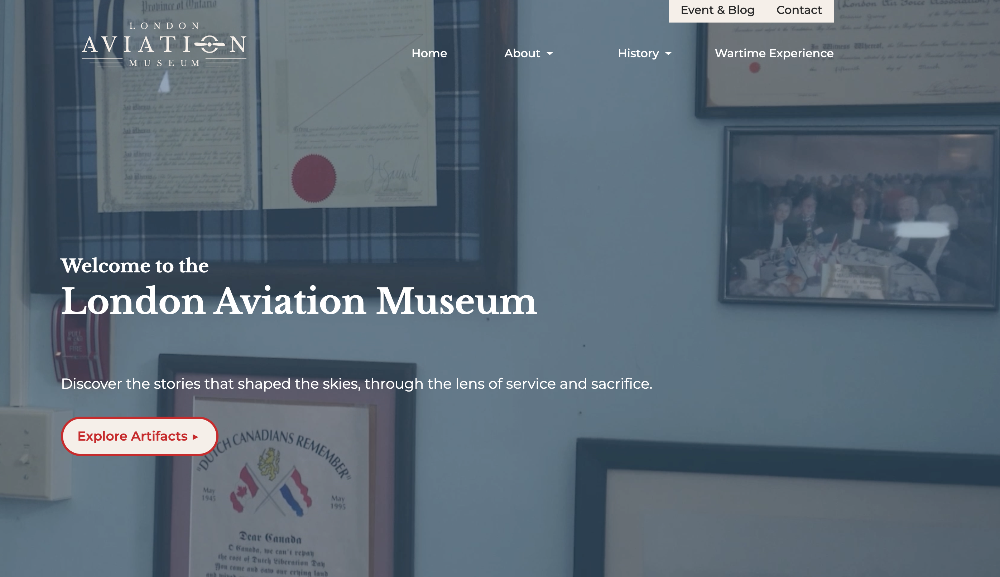

# ✈️ RunwaySix — London Aviation Museum Website




---
## 👥 Team Members

### 🎯 Project Manager
- Josephine Muncaster

### 🎨 Designers
- **Graphic Designer:** Linh Nguyen  
- **UI/UX Designer:** Tanisha Huang
- **Motion Designer:** Situ Ranjit  

### 💻 Developers
- **Frontend Developer:** Rin Morito  
- **Backend Developer:** Anh Nguyen  

---

## ✨ Project Introduction

The **London Aviation Museum Website** is a modern, responsive website developed as the official **Final Interactive Project (FIP)** for Interactive Media Design Level 4 by **Team RunwaySix**

The project highlights London's aviation heritage through storytelling, motion design, documentation and interactive web technologies. The website acts as a digital museum platform which gives a virtual tour to the visitors while maintaing accessbility and user-friendliness.

The site serves as a combination of design, development, animation and backend intergration to deliver digital experience for the visitors.

---

## 🎯 Project Objectives

- Design and develop a **mobile-first responsive website**.
- Present aviation history using engaging multimedia storytelling.
- Create visually appealing layouts using semantic HTML and SCSS architecture.
- Implement smooth greensock animations and interactive transitions.
- Integrate a custom video player for long documentary video.
- Develop dynamic sections for events/blogs, artifacts, and book of remembrance page
- Followed GitHub best practices.

---

## 🔧 Technologies Used

- **HTML5** — Semantic structure & accessibility
- **Sass / SCSS** — 7–1 architecture for scalable styling
- **CSS Grid & Flexbox** — Responsive layout system
- **JavaScript** — Interactivity & UI behavior
- **GSAP** — ScrollTrigger animations
- **Plyr.js** — Custom video player interface
- **PHP** — Contact form processing & backend logic
- **GitHub** — Version control & team collaboration
- **Figma** — Wireframes, Prototyping, UI/UX planning
- **Adobe Creative Suite** — Visual assets, motion graphics, and branding

---

## 🌟 Key Features

- **Responsive Design**  
  Optimized layouts across mobile, tablet, and desktop devices.

- **GSAP Motion System**  
  Smooth scroll-triggered animations and interactive transitions.

- **Historical Timeline Experience**  
  Structured aviation history presented through visuals, videos, and narrative content.

- **Custom Video Player**  
  Accessible video playback styled using Plyr.js.

- **Dynamic Events / Blog Section**  
   Admin space for client to update content 

- **PHP Contact Form**  
  Functional communication system with success and error handling pages.

- **Accessible Navigation System**  
  Semantic structure and clear content hierarchy for usability.

---

## 📄 Featured Pages

### London Aviation History *(Static)*
The **London Aviation History** page features timeline-based storytelling. The growing timeline encourages users to scroll further. As the timeline expands, users experience history in a visual and interactive way. This strengthens storytelling and keeps them engaged. 

### The Battle of Britain *(Static)*
The **Battle of Britain** page is basically an educational content which covers the phases, dates, and cummulative losses When the users click specific dates, it will show what happened on that day. This transforms the experience from passive reading into active exploration. And then, Pilots of Honour section highlights five local pilots, adding a personal touch to history. We also have **Battle of Britain Aircraft** slides in the bottom.

### Artifacts  *(Dynamic)*
The **Artifacts page** showcases the museum’s archival items with images, and descriptions where users can explore and learn more about each artifacts.

### Book of Remembrance  *(Dynamic)*
The **Book of Remembrance page** is a tribute to the pilots where users can search for their family member's name to learn more, or scroll through the list of information the museum has about the pilots that served. 

### Wartime Experience *(Static)*
The **Wartime Experience** allows users to click on the interactive map to view all of the training bases, as well as learn more about the training schools during the war.

### Education Page *(Static)*
 The **Education page** is where teachers can learn more about the educational resources available and bring the museum's history to the classroom for students. 

### Events / Blog *(Dynamic)*
The **Events and Blog** page is where users can read more about the history of the London Aviation Museum through featured blog posts and see upcoming events the Museum is involved in. It also allows museum administrators to publish updates, news, and commemorative events.

### Contact *(Dynamic)*
**Contact Page** allows visitors to engage and communicate directly with the organization. Highlighting success or error messages.

## 🗂 Additional Pages

### FAQ
The **FAQ page** provides answers to all common questions visitors may have about the London Aviation Museum. It covers topics such as location, special exhibits like the Airman's Canteen, ways to learn more about aviation history, etc.

### Privacy Policy
The **Privacy Policy page** shows transparency about data handling. It explains how the user's information has been collected via contact form, how it is stored with privacy standards.


---

## 🔌 API Setup (Easy Guide)

To run this project, you need to start the backend API on your computer.

---

### 🧰 Requirements
Make sure you have these installed:
- PHP (version 8 or higher)
- Composer
- Laravel

---

### 🚀 Setup Steps

#### 1. Clone the backend repository
```bash
git clone https://github.com/Alex4747-J/RunwaySix_London_Aviation_Museum-backend.git
2. Go into the project folder
cd RunwaySix_London_Aviation_Museum-backend
3. Install dependencies
composer install
4. Set up environment file
cp .env.example .env
php artisan key:generate
5. Run database migrations
php artisan migrate
6. Add sample data (all tables)
php artisan db:seed
7. Start the server
php artisan serve

--
```

## 👥 Team Responsibilities

| Name | Role | Responsibilities |
|------|------|------------------|
| Josephine Muncaster | 🎯 Project Manager | Project coordination, communication, planning, approvals |
| Linh Nguyen | 🎨 Graphic Designer | Branding, visual design system, layout aesthetics |
| Tanisha Huang | 🎨 UI/UX Designer | Sketch Wireframes, user persona, scavenger app|
| Situ Ranjit | 🎬 Motion Designer | Logo Animation, looping video, long documentary video, interview video |
| Rin Morito | 💻 Frontend Developer | HTML structure, responsive layout, styling, JS, Vue, AJAX, Video player, GSAP Animation |
| Anh Nguyen | ⚙️ Backend Developer | PHP development, form handling, CMS Dashboard |

---


## 🎨SASS Workflow
1. 🎛 Variables (colors, fonts, spacing)
2. 🧩 Modular Partials (abstracts, base, components, pages, etc.)
3. 🧹 Cleaned and easy to understand code and removed unwanted comments
4. 🗜 Minified output CSS

---

## 🔀 GitHub Workflow

**Branches Naming Convention**

- `main` — Stable production branch
- `dev.[name]` — Development features
- `design.[name]` — Styling & UI updates

**Practices Followed**
- Meaningful commit messages
- Pull Requests before merging
- Version-controlled development workflow

---

## 🎯 Learning Outcomes

- Apply real-world web production workflow.
- Strengthen responsive design and accessibility practices.
- Integrate motion design into functional web interfaces.
- Collaborate using GitHub.
- Combine design, development, and multimedia storytelling.
- Develop portfolio-ready real client based project documentation.

---

## 👨‍💻 Credits
Designed and Developed by:
**Team RunwaySix** 🎨

---

## License 

This project was created solely for educational purposes as part of the **Interactive Media Design program at Fanshawe College**. 

---

## 📫Contact
Feel free to reach out to the team:

- [Josephine Muncaster – LinkedIn](https://www.linkedin.com/in/josephine-muncaster-382674135/) 
- [Linh Nguyen – LinkedIn](https://www.linkedin.com/in/linhnguyenstudio/) 
- [Tanisha Huang – LinkedIn](https://www.linkedin.com/in/tanisha-huang/) 
- [Situ Ranjit – LinkedIn](https://www.linkedin.com/in/situ-ranjit-187970325/)  
- [Rin Morito – LinkedIn](https://www.linkedin.com/in/rin-morito-7b9868329/) 
- [Anh Nguyen– LinkedIn](https://www.linkedin.com/in/anh-nguyen-53280b266/) 